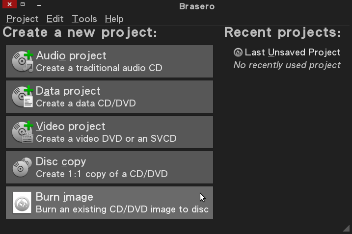

# 完全用 GNU/Linux 工作

## 建立開機媒體 (隨身碟、光碟)

規劃好作業系統及分割區以後我們還需有個開機媒體才行進行安裝，在以前 (或為了相容性) 都得燒錄光碟才可進行安裝手續；現在我們可以使用隨身碟 (Flash Disk) 來代勞，其隨身碟務必大於光碟映像檔 (image)。

凍仁常用的光碟鏡像站。
- [Clonezilla live](http://clonezilla.nchc.org.tw/clonezilla-live/download/sourceforge/)
- [CentOS 6.4](ftp://ftp.nsysu.edu.tw/Unix-like/CentOS/6.4/isos/)
- [Debian 7.1.0](ftp://free.nchc.org.tw/dists/debian-cd/7.1.0/)
- [Ubuntu 12.04.3](ftp://ftp.nsysu.edu.tw/Unix-like/Ubuntu/ubuntu-cd/12.04.3/)

### 下載映像檔

以下使用 64 位元的 Debian 7.1 為例，請自行替換成預安裝的 Linux。

	$ wget ftp://free.nchc.org.tw/dists/debian-cd/7.1.0/amd64/iso-cd/debian-7.1.0-amd64-CD-1.iso

驗證映像檔完整性。

	$ md5sum debian-7.1.0-amd64-CD1.iso
	6813af64cc9487099210afed14a080e0  debian-7.1.0-amd64-CD-1.iso

查看是否與[鏡像站](ftp://free.nchc.org.tw/dists/debian-cd/7.1.0/amd64/iso-cd/MD5SUMS)提供的驗證碼相同。

### 製作開機隨身碟

使用 fdisk 指令確認隨身碟的裝置代號。

	$ sudo fdisk -l
	......
	Disk /dev/sdc: 4127 MB, 4127195136 bytes
	255 heads, 63 sectors/track, 501 cylinders, total 8060928 sectors
	Units = sectors of 1 * 512 = 512 bytes
	Sector size (logical/physical): 512 bytes / 512 bytes
	I/O size (minimum/optimal): 512 bytes / 512 bytes
	Disk identifier: 0x6765e7ab
	
	   Device Boot      Start         End      Blocks   Id  System
	/dev/sdc1             128     8056959     4028416    6  FAT16

卸載隨身碟 (此範例隨身碟的裝置代號為 /dev/sdc，依個人環境將有所不同)。

	$ sudo umount $(mount | grep sdc | awk '{print $3}')

將映像檔寫入隨身碟中。

	$ sudo sh -c "cat debian-7.1.0-amd64-CD-1.iso > /dev/sdc" && sync && sync && sync

### 製作開機光碟

#### 使用指令燒錄空白光碟

cdrecord 

	$ sudo cdrecord -eject -speed=12 -v debian-7.1.0-amd64-CD-1.iso 

	# -eject:	退出光碟機。
	# -speed:	速度指定。
	# -v:		顯示詳細資訊 (過程)。

growisofs 

	$ growisofs -dvd-compat -Z -M /dev/dvd=debian-7.1.0-amd64-CD-1.iso

	# -Z:		指定設備。
	# -M:		關閉燒錄。

#### 使用圖形化套件 Brasero 燒錄空白光碟

若系統未附上，可使用以下指令進行安裝。

	$ sudo aptitude install brasero

選擇**燒錄映像檔** (Burn image)。

選擇映像檔並燒錄 (下圖並無偵測到光碟機，為錯誤示範)。

註：若您手上的平台是 Windows，您可以使用 ImgBurn [1] 及 CDBurnerXP [2] 燒錄映像檔。

本文同步發佈至 [凍仁的筆記](http://note.drx.tw/2013/09/working-with-linux-02-build-bootable-usb-cd.html)、[iT邦幫忙](http://ithelp.ithome.com.tw/question/10127775)。

## Reference

相關連結：

- [1] [ImgBurn免費才是您唯一的選擇~建立映像檔案、燒錄資料:::iThome Download-你要的軟體在這裡:::](http://download.ithome.com.tw/article/index/id/758)
- [2] [CDBurnerXP: Burn ISO images to disc](http://cdburnerxp.se/help/Data/burn-iso)

資料來源：

- [How do I write CD at Debian Linux command prompt](http://www.cyberciti.biz/tips/how-do-i-write-cd-at-debain-linux-command-prompt.html)
- [How to burn an ISO image | CentOS.org](http://www.centos.org/docs/5/html/CD_burning_howto.html)
- [蚊子館: cdrecord - 命令用法](http://linux-guys.blogspot.tw/2011/01/cdrecord.html)
- [燒錄 ISO 映像檔](http://ms.ntcb.edu.tw/~steven/tips/burn-iso.htm)

