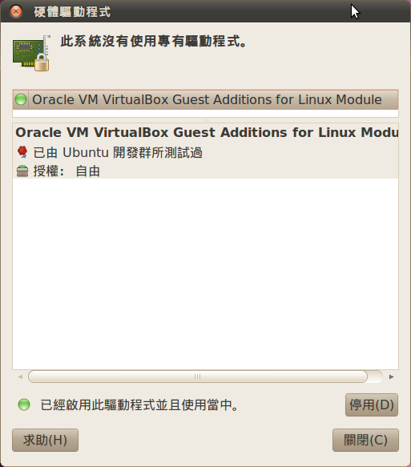

# 完全用 GNU/Linux 工作

## 06. 安裝驅動程式

要想完全駕御一台電腦並將發揮到最大功效，我們必需讓軟體 (女方) 與硬體 (男方) 互相認識且達到良好的溝通，而這些負責溝通的軟體我們稱之為[驅動程式](http://zh.wikipedia.org/wiki/%E9%A9%B1%E5%8A%A8%E7%A8%8B%E5%BA%8F) (媒婆)。在 Windows 上有**裝置管理員**，在 Ubuntu 上也有圖形界面的**硬體驅動程式 (Jockey)** 可以使用，但在 Debian 或是其它的發行版本上不見得會有 (Jockey 並不是萬靈丹，GNU/Linux 硬體支援度已比先前進步不少，但多少還是會發生找不到的情形)，這時我們就必須使用 **lspci** 指令來取得各個 PCI 裝置的型號，並一步步補完之。

▲ jockey-gtk on Ubuntu 10.04。

### GNU/Linux 底下為常見需待補的驅動程式

- **桌機 (Desktop)**: 顯示卡。
- **筆電 (Laptop)**: 顯示卡、無線網卡。
- **伺服器 (Server)**: 硬碟、RAID 控制卡 (RAID bus controller)。

以 ThinkPad T410 這台筆電為例，裝完機後得補上**顯示卡**及**無線網卡**，有了 lspci 我們就不太需要拆機殼查看主機板、顯卡的型號。

	$ lspci
	......
	00:19.0 Ethernet controller: Intel Corporation 82577LM Gigabit Network Connection (rev 06)
	......
	00:1b.0 Audio device: Intel Corporation 5 Series/3400 Series Chipset High Definition Audio (rev 06)
	......
	00:1f.2 SATA controller: Intel Corporation 5 Series/3400 Series Chipset 6 port SATA AHCI Controller (rev 06)
	......
	01:00.0 VGA compatible controller: NVIDIA Corporation GT218 [NVS 3100M] (rev a2)
	01:00.1 Audio device: NVIDIA Corporation High Definition Audio Controller (rev a1)
	03:00.0 Network controller: Intel Corporation Centrino Wireless-N 1000 [Condor Peak]
	0d:00.0 SD Host controller: Ricoh Co Ltd MMC/SD Host Controller (rev 01)
	......

	# Ethernet controller:			有線網卡
	# SATA controller:				硬碟。
	# Audio device:					音效卡。
	# Network controller:			無線網卡。
	# VGA compatible controller:	顯示卡。

取得型號後請直接到 Google 尋找前人的解法，基本上 Intel, NVIDIA 都會有完整的解決方案。凍仁也曾遇過硬體太新無法驅動的情況 (好比 T410 的觸控板在 Ubuntu 11.04 以前無法使用兩點觸控)，這時只好等待下次釋出的新版本，看看有沒有辦法解決。若某功能您覺得真的不用不行，那可能得踏上自行編譯一途。

### 資料來源

- [lspci - manned.org](http://manned.org/lspci/4207eed7)
- [凍仁的筆記: Debian 6.0 (Squeeze) Note](http://note.drx.tw/2011/02/thinkpad-t410-on-debian-squeeze.html)
- [凍仁的筆記: 指紋辨識系統 on Ubuntu 10.04, 11.04+](http://note.drx.tw/2012/03/fingerprint-reader-on-ubuntu-1110.html)
- [凍仁的筆記: 藉由 Gobi 2000 啟用 ThinkPad T410 行動網路 on Ubuntu 10.04](http://note.drx.tw/2012/05/enable-wwan-with-gobi2000-at-t410.html)
- [凍仁的筆記: 安裝 Toshiba Satellite C850 無線網卡驅動 on Ubuntu 12.04](http://note.drx.tw/2013/01/rtl8723e-on-toshiba-c850.html)

