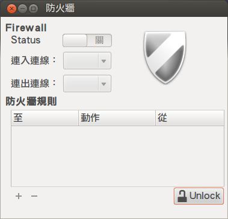
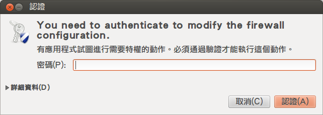
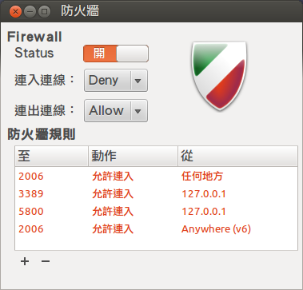
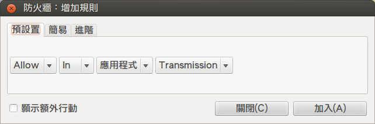
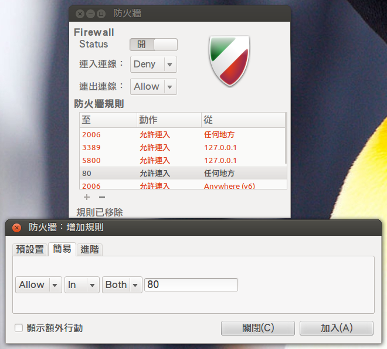
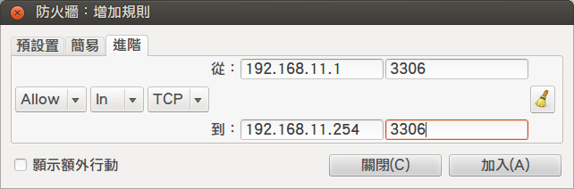

# 完全用 GNU/Linux 工作

## 07. 簡易的防火牆 (ufw)

從 2008 年開始 Ubuntu 8.04 LTS 多了個簡單的防火牆「[ufw (Uncomplicated Firewall)](http://en.wikipedia.org/wiki/Uncomplicated_Firewall)」，它簡化了 iptable 複雜的指令及參數，讓人們能快速上手，之後更出現了圖形介面的 [Gufw](http://gufw.org/) (甚至連指令都免了)。原先為了 Ubuntu 而誕生的 ufw 現在也成功移植到基於 Debian 發展的 GNU/Linux ([ezgo](http://ezgo.westart.tw/ezgoX/), [Linux Mint](http://www.linuxmint.com/)) 以及 [Arch Linux](http://archlinux.tw/)。

###  UFW

若系統尚未預載 ufw，請手動安裝。

	# Debian, Ubuntu
	$ sudo aptitude install ufw 

	# Arch Linux
	$ sudo pacman -S ufw

####  基礎操作

狀態查詢，預設為閒置 (inactive)。

	$ sudo ufw status
	Status: inactive

啟動 ufw 服務 (enable)。

	$ sudo ufw enable

預設 (default) 全部阻擋 (deny)。

	$ sudo ufw default deny

允許 (allow) 所有的 ssh 埠口連線。

	$ sudo ufw allow ssh

允許來自 127.0.0.1 (本機) 的 3389 埠口連線 (xrdp)。

	$ sudo ufw allow from 127.0.0.1 to any port 3389

狀態查詢，已成功啟動 (active) 並加入自訂規則。

	$ sudo ufw status
	Status: active
	
	To			Action	From
	--			------	----
	22			ALLOW 	Anywhere
	3389		ALLOW 	127.0.0.1

#### 進階使用

允許來自 192.168.1.2 上所有連線。 

	$ sudo ufw allow from 192.168.1.2

允許來自 192.168.2.1 ~ 192.168.2.254 的所有 22 埠口連線。 

	$ sudo ufw allow from 192.168.2.1/24 to any port 22

阻擋來自 110.88.4.5 的 22 埠口連線。 

	$ sudo ufw deny from 110.88.4.5 to any port 22

阻擋來自 27.16.3.1 ~ 27.16.3.254 的所有連線。 

	$ sudo ufw deny from 27.16.3.0/24

### Gufw

圖形介面的 Gufw 必須手動安裝，但不建議純文字環境的 GNU/Linux 安裝，它會與一些桌面環境 (Desktop Environment) 的套件產生相依性，例如 gir1.2-gtk-3.0, notify-osd ... 等。

	# Debian, Ubuntu
	$ sudo aptitude install gufw 

	# Arch Linux
	$ sudo pacman -S gufw

####  圖形操作

開啟 Gufw：

請於*應用程式 (Application) -> 系統 (System) -> 管理 (Administration) -> 防火牆設定 (Firewall configuration)*開啟；或直接於終端機輸入指令開啟。

	$ gufw

 ▲ 使用前得先用管理者帳號解鎖 (Unlock)。

 ▲ 輸入密碼。

 ▲ 解鎖後可看到先前自訂的規則，以下為新增規則之範例。

 ▲ 可依應用程式自訂規則。

 ▲ 也可自行輸入埠口。

 ▲ 進階設定裡則可依範圍自訂規則。

看完此文後，相信大家都能幫 GNU/Linux 加上一道防護，但 ufw 這面防護罩只適合簡易、單純的環境，若有 NAT 或更進階的使用還請改用 iptable。

### 資料來源
	
- [CreMaker 的生活雜記: 談談 ufw](http://cm-life.blogspot.tw/2008/05/ufw.html)
- [ufw in Launchpad](https://launchpad.net/ufw)
- [UFW - Community Ubuntu Documentation](https://help.ubuntu.com/community/UFW#Allow_Access)
- [Gufw - Community Ubuntu Documentation](https://help.ubuntu.com/community/Gufw)
- [Uncomplicated Firewall - ArchWiki](https://wiki.archlinux.org/index.php/Uncomplicated_Firewall)
