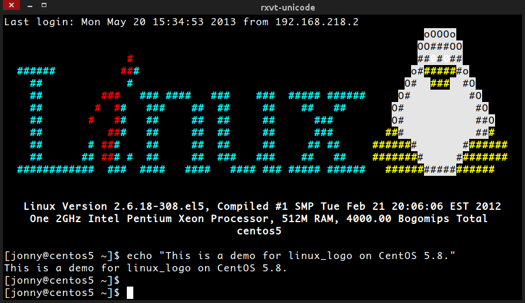
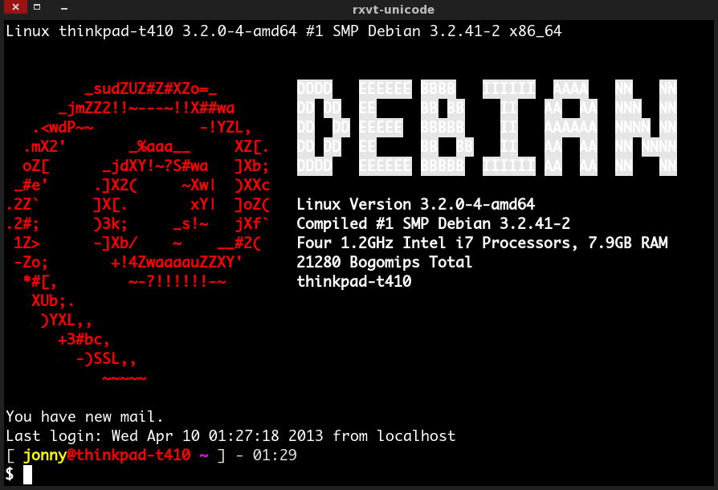

# 完全用 GNU/Linux 工作

## 09. Hacking Bash

真要說 GNU/Linux 有哪裡吸引人，那就是 bash 裡的純文字世界了 (它可是比 Windows 上的**命令提示字元**還強大呢！)，只要我們熟知各種指令及純文字編輯器，就可以完全駕馭電腦，當電腦的主人。但 Bash 的博大精深凍仁很難用一篇文章來解釋，這裡只能簡述些凍仁平時常用的部份，相信[《鳥哥的 Linux 私房菜》](http://linux.vbird.org/linux_basic/0320bash.php)上面會寫的比凍仁更詳細。
	

 ▲ 原生的 Bash (on CentOS)。

### 補完自動補齊功能

開始前有個不得不提的好物，那就是 **bash-completion**，它可以強化 GNU/Linux 的自動補齊功能 (completion)，但 CentOS 必須得自行加入 EPEL 來源的套件庫才找的到 (詳請可參考先前的 [05. 套件庫及鏡像站](05.reopsiroty-and-mirror.md) 一文)。

安裝

	# Debian, Ubuntu
	$ sudo aptitude install bash-completion

	# CentOS with epel repo.
	$ sudo yum install bash-completion

使用

	# Debian, Ubuntu
	$ sudo aptitude <Tab> <Tab> <Tab> ...

	# CentOS, RHEL, Fedora
	$ sudo yum <Tab> <Tab> <Tab> ...
	
### 凍仁的環境設定

如想取得完整的 bash 環境設定，請參考 [凍仁的 GitHub](https://github.com/chusiang/tuxENV)。

	# 下載凍仁的環境設定。
	$ git clone https://github.com/chusiang/tuxENV.git

	# 切換目錄。
	$ cd tuxENV/

	# 備份原設定。
	$ make backup

	# 安裝。
	$ make install

以下設定可寫入 $HOME/.bashrc，這樣下次啟動 bash 時設定才會存在。

將語系指定成英文語系 (en_US.UTF-8) ：因 tty (Ctrl + Alt + F1) 底下預設不支援中文，故新增此設定，適合進階使用者。

	# - language
	tty=`tty`
	t=`echo $tty|awk -F "/" '{print $3}'`
	if [ "$(tty)" = "/dev/tty1" ] || [ $t = pts ]; then
	 export LANGUAGE="en_US.UTF-8"
	 export LANG="en_US.UTF-8"
	 export LC_ALL="en_US.UTF-8"
	fi

ls 顏色設定：部份的 GNU/Linux 使用 ls 時的顏色不易閱讀，故手動更改。

	export LS_COLORS='rs=0:di=01;34:ln=01;36:mh=00:pi=40;33:so=01;35:do=01;35:bd=40;33;01:cd=40;33;01:or=40;31;01:su=37;41:sg=30;43:ca=30;41:tw=30;42:ow=34;42:st=37;44:ex=01;32:*.tar=01;31:*.tgz=01;31:*.arj=01;31:*.taz=01;31:*.lzh=01;31:*.lzma=01;31:*.tlz=01;31:*.txz=01;31:*.zip=01;31:*.z=01;31:*.Z=01;31:*.dz=01;31:*.gz=01;31:*.lz=01;31:*.xz=01;31:*.bz2=01;31:*.bz=01;31:*.tbz=01;31:*.tbz2=01;31:*.tz=01;31:*.deb=01;31:*.rpm=01;31:*.jar=01;31:*.war=01;31:*.ear=01;31:*.sar=01;31:*.rar=01;31:*.ace=01;31:*.zoo=01;31:*.cpio=01;31:*.7z=01;31:*.rz=01;31:*.jpg=01;35:*.jpeg=01;35:*.gif=01;35:*.bmp=01;35:*.pbm=01;35:*.pgm=01;35:*.ppm=01;35:*.tga=01;35:*.xbm=01;35:*.xpm=01;35:*.tif=01;35:*.tiff=01;35:*.png=01;35:*.svg=01;35:*.svgz=01;35:*.mng=01;35:*.pcx=01;35:*.mov=01;35:*.mpg=01;35:*.mpeg=01;35:*.m2v=01;35:*.mkv=01;35:*.webm=01;35:*.ogm=01;35:*.mp4=01;35:*.m4v=01;35:*.mp4v=01;35:*.vob=01;35:*.qt=01;35:*.nuv=01;35:*.wmv=01;35:*.asf=01;35:*.rm=01;35:*.rmvb=01;35:*.flc=01;35:*.avi=01;35:*.fli=01;35:*.flv=01;35:*.gl=01;35:*.dl=01;35:*.xcf=01;35:*.xwd=01;35:*.yuv=01;35:*.cgm=01;35:*.emf=01;35:*.axv=01;35:*.anx=01;35:*.ogv=01;35:*.ogx=01;35:*.aac=00;36:*.au=00;36:*.flac=00;36:*.mid=00;36:*.midi=00;36:*.mka=00;36:*.mp3=00;36:*.mpc=00;36:*.ogg=00;36:*.ra=00;36:*.wav=00;36:*.axa=00;36:*.oga=00;36:*.spx=00;36:*.xspf=00;36:'

- [ls 顏色設定 (in Bash shell) - Tsung's Blog](http://blog.longwin.com.tw/2006/07/color_ls_in_bash_2006/)
- [COLORS Lscolors - Linux StepByStep](http://linux-sxs.org/housekeeping/lscolors.html)

別名 (Alias)。

	alias la='ls -A'
	alias ll='ls -l'

自訂 PS1 顏色：除了色彩較為豐富，也可用來辨識機器，以避免關錯電腦。

	# == Colors ==
	red='\[\033[0;31m\]'
	RED='\[\033[1;31m\]'
	green='\[\033[0;32m\]'
	GREEN='\[\033[1;32m\]'
	yellow='\[\033[0;33m\]'
	YELLOW='\[\033[1;33m\]'
	blue='\[\033[0;34m\]'
	BLUE='\[\033[1;34m\]'
	purple='\[\033[0;35m\]'
	PURPLE='\[\033[1;35m\]'
	cyan='\[\033[0;36m\]'
	CYAN='\[\033[1;36m\]'
	white='\[\033[0;37m\]'
	WHITE='\[\033[1;37m\]'
	NC='\[\033[0m\]'        # No Color

	PS1="${white}[ ${YELLOW}\u${RED}@\h ${PURPLE}\w ${white}] - \A \n${WHITE}\$ ${NC}"

 ▲ 自訂 PS1 後的 Bash (Debian)。。

- [Color Bash Prompt - ArchWiki](https://wiki.archlinux.org/index.php/Color_Bash_Prompt)

使用 Vi 模式控制 Bash，預設為 Emacs 模式。

	set -o vi

### 快捷鍵

快速搜尋使用過的指令。

	ESC + /
	Ctrl + r

往前刪除一字元，同 Backspace 鍵。

	Ctrl + h

送出確認／回傳，同 Enter 鍵。

	Ctrl + j

清除游標以前的一個單字。

	Ctrl + w

清除游標以前所有的字完。

	Ctrl + u

### 指令簡介

#### 常用指令

這裡列出凍仁最常用的前 10 筆指令 (2013-01-25 21:47:40 ~ 2013-09-26 21:09:05)。

	$ history | awk '{print $2}' | sort | uniq -c | sort -nr | nl | less
     1     2971 ls
     2     2236 cd
     3     1843 git
     4     1180 sudo
     5      484 cat
     6      354 mv
     7      354 gpg
     8      322 vi
     9      304 ssh
    10      255 cp

##### ls

列出檔案及目錄。

	[ jonny@raspberrypi ~ ] - 21:42 
	$ ls
	bin  public_html  tmp  vcs
	[ jonny@raspberrypi /tmp ] - 21:43 
	$ 

##### cd

切換目錄。

	[ jonny@raspberrypi ~ ] - 21:42 
	$ cd /tmp
	[ jonny@raspberrypi /tmp ] - 21:42 
	$ 

##### git

可以讓檔案進行儲存、分支的分散式版本控制系統，好比玩單機遊戲時我們會先儲存以得到最美好的結局。詳情請參考 [Git Magic - 前言](http://www-cs-students.stanford.edu/~blynn/gitmagic/intl/zh_tw/) 一文。

##### sudo

暫時取得管理者權限。議平時別用超級管理者登錄，待有需要時再用 sudo，可有效降低人為失誤的風險。詳情請參考 [凍仁的筆記: sudo 指令使用說明](http://note.drx.tw/2008/01/linuxsudo.html) 一文。

	[ jonny@raspberrypi ~ ] - 21:45 
	$ sudo /etc/init.d/nginx restart
	[sudo] password for jonny: 
	Restarting nginx: nginx.
	[ jonny@raspberrypi ~ ] - 21:45 
	$ 

##### cat

查看檔案內容。

	[ jonny@raspberrypi ~ ] - 21:46 
	$ cat /etc/issue
	Raspbian GNU/Linux 7 \n \l

##### mv

搬移檔案及目錄。

	[ jonny@raspberrypi ~/lab ] - 22:24 
	$ ls
	1234567
	[ jonny@raspberrypi ~/lab ] - 22:24 
	$ mv 1234567 7654321; ls
	7654321

##### gpg

加密、數位簽章及產生非對稱式金鑰的軟體，本次篇幅不會提到。，詳情請參考 [GnuPG - 維基百科](http://zh.wikipedia.org/wiki/GnuPG) 一文。

##### vi

使用 H, J, K, L 取代左、下、上、上移動的純文字編輯器。詳情請參考 [[完全用 GNU/Linux 工作] 11. Hacking Vim](11.hacking-vim.md) 一文。

##### ssh

遠端連線。

	[ jonny@thinkpad-t410 ~ ] - 23:28 
	$ ssh jonny@192.168.11.6
	Linux raspberrypi 3.6.11+ #538 PREEMPT Fri Aug 30 20:42:08 BST 2013 armv6l
	
	The programs included with the Debian GNU/Linux system are free software;
	the exact distribution terms for each program are described in the
	individual files in /usr/share/doc/*/copyright.
	
	Debian GNU/Linux comes with ABSOLUTELY NO WARRANTY, to the extent
	permitted by applicable law.
	Last login: Thu Sep 26 23:19:56 2013 from 192.168.11.9
	[ jonny@raspberrypi ~ ] - 23:28 
	$ 

##### cp

複製檔案。

	[ jonny@thinkpad-t410 ~/tmp/lab ] - 23:48 
	$ ls
	tux.txt
	[ jonny@thinkpad-t410 ~/tmp/lab ] - 23:48 
	$ cp tux.txt helloTu.txt
	[ jonny@thinkpad-t410 ~/tmp/lab ] - 23:48 
	$ ls
	helloTu.txt  tux.txt

#### 進階指令 

將使用 markdown 語法所撰寫的的文件 07.ufw.md 藉由 markdown_py 轉換成 HTML 格式，並導向 (>) 指定的檔案 07.ufw.html。

	$ markdown_py 07.ufw.md > 07.ufw.html

使用 cat 檢視檔案，並將結果丟給管線 (pipe) 後的程式處理 (xlip: 複製內容至剪貼簿)。

	$ cat 07.ufw.html | xclip

透過 grep 過濾出已安裝的套件。

	$ sudo aptitude search vim | grep ^i
	i   vim                             - Vi IMproved - enhanced vi editor          
	i A vim-addon-manager               - manager of addons for the Vim editor      
	i   vim-common                      - Vi IMproved - Common files                
	i   vim-gnome                       - Vi IMproved - enhanced vi editor - with GN
	i A vim-gui-common                  - Vi IMproved - Common GUI files            
	i A vim-runtime                     - Vi IMproved - Runtime files               
	i   vim-syntax-gtk                  - Syntax files to highlight GTK+ keywords in
	i   vim-tiny                        - Vi IMproved - enhanced vi editor - compact

藉由指令操控一切真的是一件令人高興的事情，但有些時後它不見得符合我們的需求，這時就可藉由指令的大集合「Shell Scripts」來達到深層的客製化指令。

### 資料來源

- [bash shell 入門 第三版 | O'Reilly](http://www.oreilly.com.tw/product_linux.php?id=a171)
- [凍仁的筆記: bash](http://note.drx.tw/search/label/bash)
- [凍仁的筆記: Shell Scripts](http://note.drx.tw/search/label/Shell%20Scripts)

