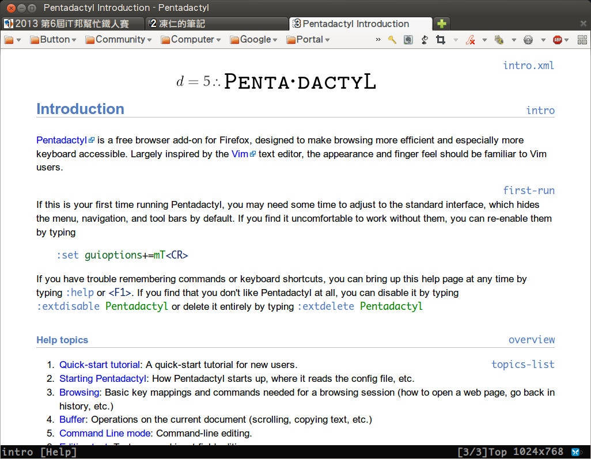
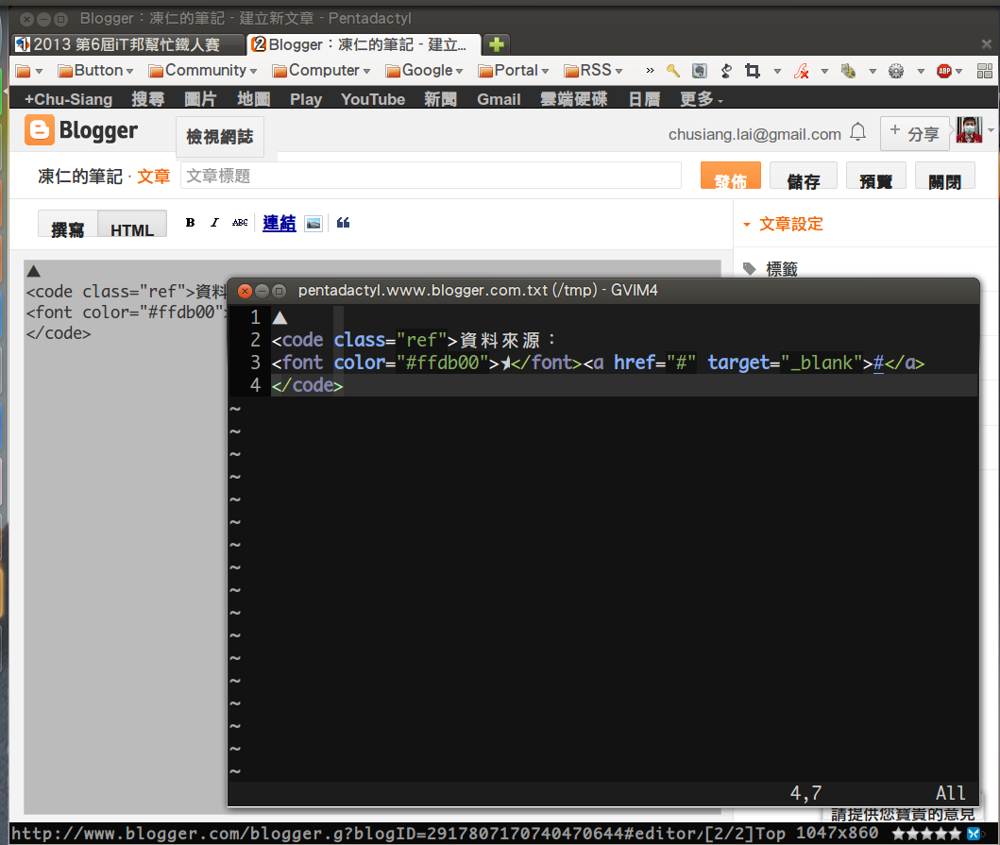

# 完全用 GNU/Linux 工作

## 13. Pentadactyl

▲ Pentadactyl 操作手冊 (:help)。

### 快速上手

圖形設定

	:set go+=mTB<CR>	# 顯示選單列、分頁列及書籤列。

頁面捲動

	j		" 往下捲動一行。
	k		" 往上捲動一行。
	<C-f>	" 往下捲動一頁。
	<C-b> 	" 往上捲動一頁。

分頁及歷史記錄

	gt	" 前往下個分頁。
	gT	" 前往上個分頁。
	g0	" 前往第一個分頁。
	g$	" 前往最後一個分頁。
	d	" 關閉當前分頁。

	t drx.tw	" 開啟新分頁，可依輸入的文字進行搜尋或開啟書籤、歷史記錄。
	o drx.tw	" 於當前分頁進行搜尋或開啟書籤、歷史記錄。

### hacking pentadactylrc

如不想使用凍仁的 Pentadactyl 環境設定 (pentadactylrc)，請跳過此步驟。

下載凍仁的環境設定。

	[ jonny@wheezy ~ ]$
    $ wget https://raw.github.com/chusiang/tuxENV/master/home/_pentadactylrc

將設定檔移至家目錄底下。

	[ jonny@wheezy ~ ]$
    $ mv _pentadactylrc ~/.pentadactylrc

重開 Firefox (或於 Pentadactyl 底下使用 *:source ~/.pentadactylrc* 重新讀取設定 )。

### 設定簡述

以下設定需寫在 *~/.pentadactylrc* 才可儲存。

圖形設定

	:set guioptions=BNs		" 預設只顯示書籤列 (B)、顯示分頁編號 (N)、狀態列 (s)。

頁面捲動

	map -modes=n j -builtin 3j	" 將 j 至換成往下三行。
	map -modes=n J <C-d>		" 將 J 至換成往下半頁。
	map -modes=n k -builtin 3k	" 將 k 至換成往上三行。
	map -modes=n K <C-u>		" 將 K 至換成往上半頁。
	map -modes=n b <PageUp>		" 將 b 至換成往上一頁 (b 原先為 buffer 的快捷鍵)。

分頁切換

	map -modes=n <A-e> <C-S-e>			" Alt + e : 開啟群組分頁。
	map -modes=n <A-j> gt				" Alt + j : 前往下個分頁。
	map -modes=n <A-k> gT				" Alt + k : 前往上個分頁。
	map -modes=n <A-1> -builtin 1gt		" Alt + 1 : 前往第 1 個分頁。
	map -modes=n <A-2> -builtin 2gt		" Alt + 2 : 前往第 2 個分頁。
	map -modes=n <A-3> -builtin 3gt		" Alt + 3 : 前往第 3 個分頁。
	map -modes=n <A-4> -builtin 4gt		" Alt + 4 : 前往第 4 個分頁。
	map -modes=n <A-5> -builtin 5gt		" Alt + 5 : 前往第 5 個分頁。
	map -modes=n <A-7> -builtin 7gt		" Alt + 7 : 前往第 7 個分頁。
	map -modes=n <A-8> -builtin 8gt		" Alt + 8 : 前往第 8 個分頁。
	map -modes=n <A-9> -builtin 99gt	" Alt + 9 : 前往最後一個分頁。

快速推文。

	" sf : 將文章分章至 Facebook。
	map -modes=n sf o javascript:var%20d=document,f='http://www.facebook.com/share',l=d.location,e=encodeURICompon
	ent,p='.php?src=bm&v=4&i=1253986134&u='+e(l.href)+'&t='+e(d.title);1;try{if%20(!/^(.*\.)?facebook\.[^.]*$/.tes
	t(l.host))throw(0);share_internal_bookmarklet(p)}catch(z)%20{a=function()%20{if%20(!window.open(f+'r'+p,'sharer','toolbar=0,status=0,resizable=1,width=626,height=436'))l.href=f+p};if%20(/Firefox/.test(navigator.userAgent))setTimeout(a,0);else{a()}}void(0) <Return>

	" sp : 將文章分章至 Plurk。
	map -modes=n sp o javascript:%20void(window.open('http://www.plurk.com/m?qualifier=shares&content='%20.concat(encodeURIComponent(location.href))%20.concat('%20')%20.concat('(')%20.concat(encodeURIComponent(document.title))%20.concat(')'))); <Return>

依選取文字搜尋及前往。

	" 於當前分頁。
	map -modes=n o -js content.getSelection().toString()!=""?dactyl.execute(":open "+ content.getSelection()):Comm
	andExMode().open("open ")

	" 於新分頁。
	map -modes=n t -js content.getSelection().toString()!=""?dactyl.execute(":tabopen "+ content.getSelection()):C
	ommandExMode().open("tabopen ")

### 提示瀏覽 (surfing with hints)

於 **normal mode** 鍵入 f 及 F 時，Pentadactyl 會對所有的連結 (link) 進行提示 (hints)，我們可透過鍵入 hints 的代號來開啟連結，其中 F 多了個背景開啟的屬性。

	" 將提示代號自訂為 asdfghjkl;。
	set hintkeys=asdfghjkl;
	
	" 字形、字體調整。
	hi Hint font:bold 16px monospace !important; margin:-.2ex; padding: 0 0 0 1px; outline:1px solid rgba(0, 0, 0, .5); background:rgba(255, 248, 231, .8); color:black; text-transform:uppercase;

▲ hints 截圖。

### 外部編輯器模式

只要於文字框 (text) 按下 **Ctrl + i** 即可使用外部的 editor 編輯。

	" GVim 
	set editor='gvim -f +<line> +"sil! call cursor(0, <column>)" <file>'

	" Bluefish
	set editor='bluefish'

▲ Ctrl + i 啟用外部編輯器模式。

### 緩衝區 (buffer) / 網頁切換

類似 **TextMate 的 Cmd + T** 以及 [ctrlp.vim](https://github.com/kien/ctrlp.vim) 的功能，可以於 **normal mode**使用關鍵字搜尋並開啟網址。為求與 ctrlp.vim 相同的使用體驗，凍仁把原先快捷鍵 **b** 換成 **Ctrl + p** 了。

	map -modes=n,v <C-p> -builtin b		" 使用 Ctrl + p 開啟 buffer。

▲ buffer 比較：上為 Pentadactyl；下為 Vim。

### 相關連結：

- [五指操控Firefox的「仿Vim」擴充套件: Vimperator/Pentadactyl | 簡睿隨筆簡睿隨筆](http://jdev.tw/blog/2375/firefox-addon-vimperator-pentadactyl-vim-like)
- [ctrlp.vim : O3noBLOG](https://blog.othree.net/log/2012/11/10/ctrlpvim/)
- [介紹 plugin: ctrlp.vim - Google 網上論壇](https://groups.google.com/forum/#!topic/vim-taiwan/dnuDsKmDRz4)
- [凍仁的筆記: Pentadactyl, Firefox F1 大亂鬥 on Firefox 4](http://note.drx.tw/2011/02/pentadactyl-firefox-f1-on-firefox-4.html)
- [凍仁的筆記: 自訂 Vimium 快捷鍵](http://note.drx.tw/2011/07/chromevimium.html)
- [Vimperator Vs Pentadactyl - vimperator-labs](http://code.google.com/p/vimperator-labs/wiki/VimperatorVsPentadactyl)

