# 完全用 GNU/Linux 工作

## 18. 藉由 CrossOver 安裝 Microsoft Office 2007

純文字的世界不是萬能的，雖說有 [Markdown](http://zh.wikipedia.org/wiki/Markdown), [reStructuredText](http://zh.wikipedia.org/wiki/ReStructuredText) 及 [LaTeX](http://zh.wikipedia.org/wiki/LaTeX) 這些很棒的語法可以編寫文件，可它們還是會有不適用的情形 (例如：老師交待的報告、老闆要的報表 …)。

我們或許可改用 LibreOffice 來過關，但凍仁還是比較喜歡在 GNU/Linux 裡使用 Microsoft Office 的方案，這樣就可以直接避開文件的相容性問題。

 ▲ Microsoft Office 2007 於 Ubuntu 12.04 LTS 上的截圖。

### 安裝 Microsoft Office 2007

若手邊的 Office 為映像檔，必須先掛載才可進行安裝程序。

	$ sudo mount -o loop OFFICE12.iso /mnt

接續[上文](17.crossover.md)的最後，接下來就可以開始安裝 Microsoft Office 了，以下使用 2007 為範例。

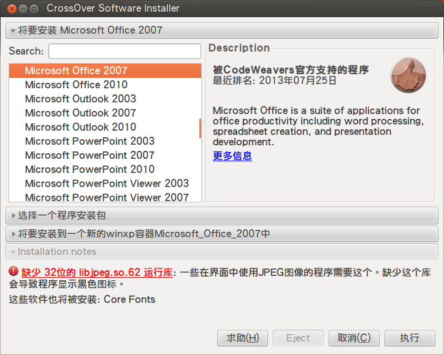

 ▲ 於列表中選取 **Microsoft Office 2007** 並按下**執行**。

若出現「缺少 31位的 libjpeg.so.62 函式庫」的訊息，請順手補上 libjpeg62:i386 一套件。

	$ sudo aptitude install libjpeg62:i386

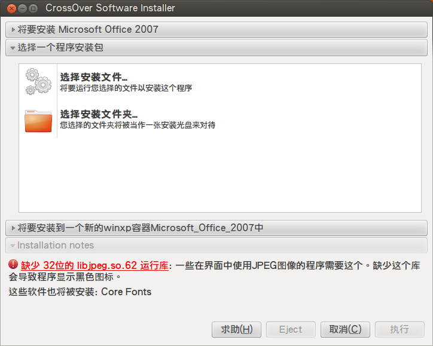

 ▲ 按下**選擇安裝文件夾**並將其設定成 /mnt。

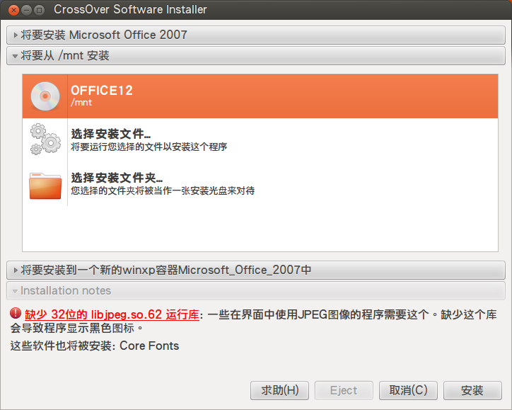

 ▲ CrossOver 已經很聰明的將 Office 的安裝光碟辨識出來。

 ▲ 裝完 libjpeg62 後有重開 CrossOver 的伙伴就會看紅字已消失，接著請按**安裝**。

 ▲ 使用 CrossOver 的好處就是它會自行建立所需要環境，不像使用 Wine 時調了一堆選項還不見得可以動。

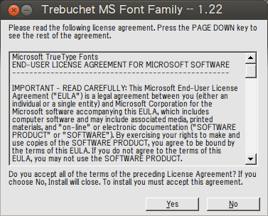

 ▲ 安裝 MS Font Family。

 ▲ 輸入產品金鑰。

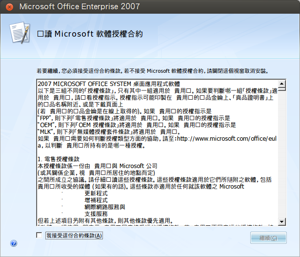

 ▲ 軟體授權同意書。

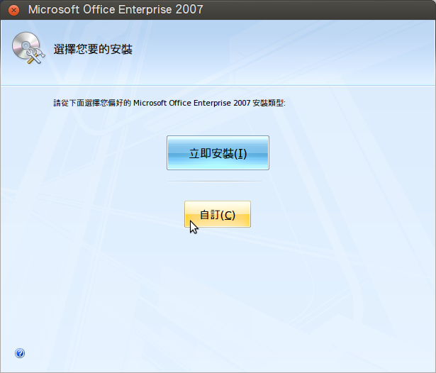

 ▲ 部份軟體不見得用的到，可於**自訂**取消之。

 ▲ 請依個人需求選取欲安裝的部份。

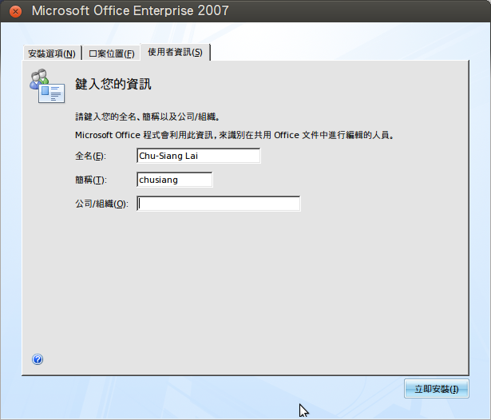

 ▲ 輸入使用者的相關資訊。

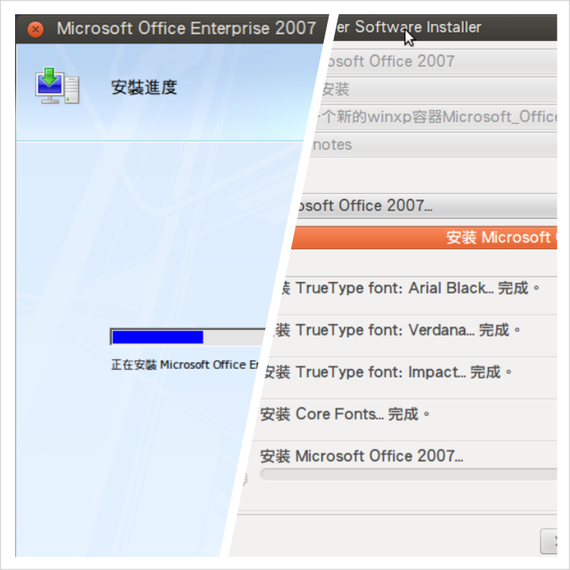

 ▲ 安裝 Office 的同時也可以看到 CrossOver 也完成了不少項目。 

 ▲ 安裝完成。

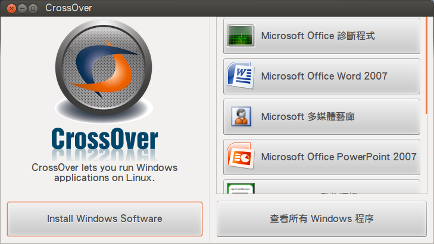

 ▲ 完成後就可以於 CrossOver 的初始畫面中看到 Office 的相關軟體。

#### 安裝 PDF / XPS 增益集 (plugin)

一份正式的文件，除了要保留原始檔 (doc, xls, ppt) 之外，建議也存一份 PDF，這樣才可確保在其它機器上能有正確的呈現。Office 2007 預設沒有另存成 PDF 的功能，需手動下載並安裝 **SaveAsPDFandXPS.exe** 才行。

 ▲ 從官方 Microsoft 下載中心下載 [2007 Microsoft Office 增益集：Microsoft 另存 PDF 或 XPS 檔](http://www.microsoft.com/zh-tw/download/details.aspx?id=7)。

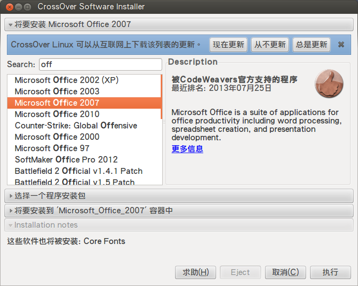

 ▲ 回到安裝 Office 的畫面，並記得將容器指定為 **Microsoft_Office_2007**。

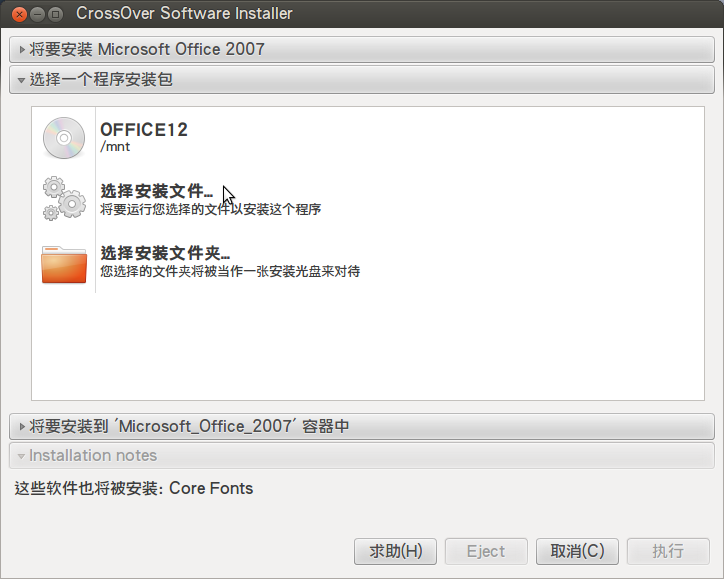

 ▲ 與上次不同，這次得使用**選擇安裝文件**進行。

 ▲ 找到從官網下載的 **SaveAsPDFandXPS.exe** 並**開啟**。

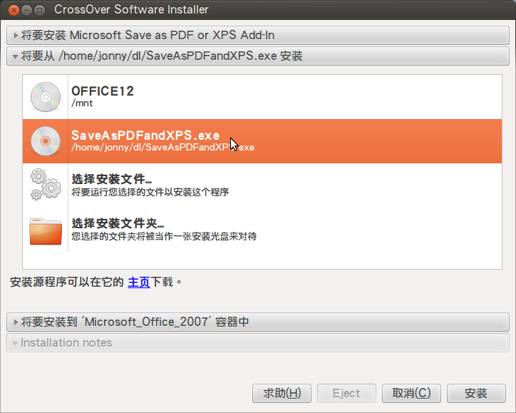

 ▲ 確認容器、plugin 無誤後就可以繼續安裝了。

 ▲ 勾選並同意軟體授權。

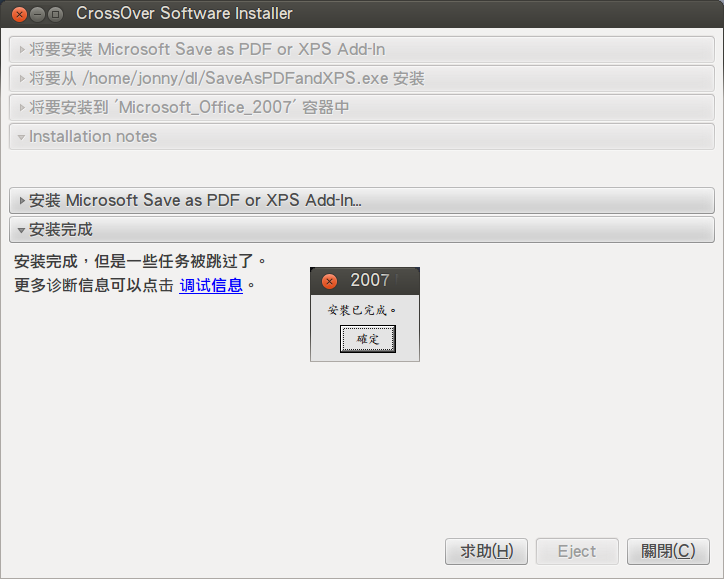

 ▲ 完成，這下 Office 2007 也可將文件另存成 PDF 了。

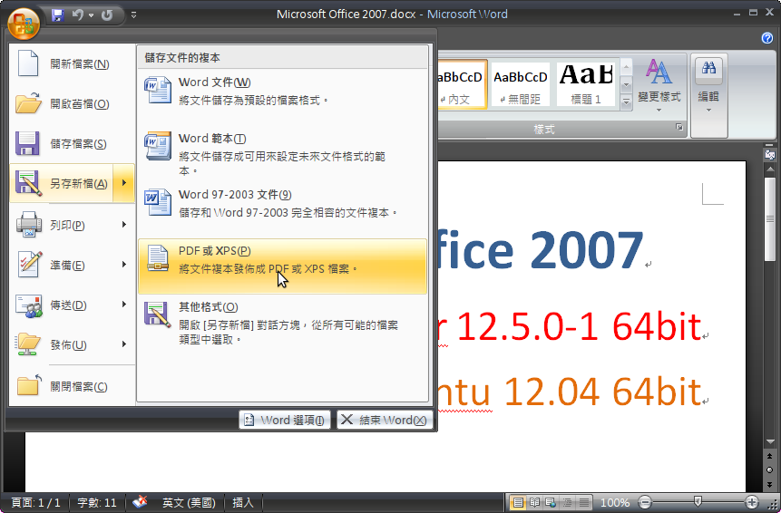

 ▲ 在**另存新檔**裡多了**PDF 或 XPS (P)**。

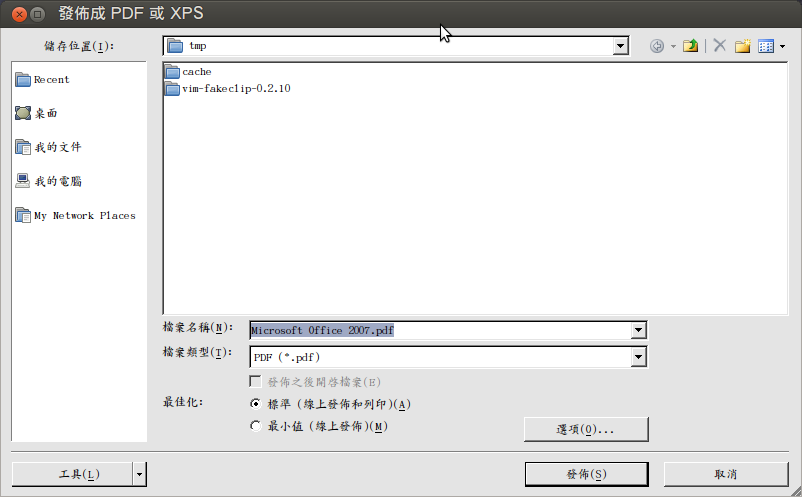

 ▲ 選擇存放位置。

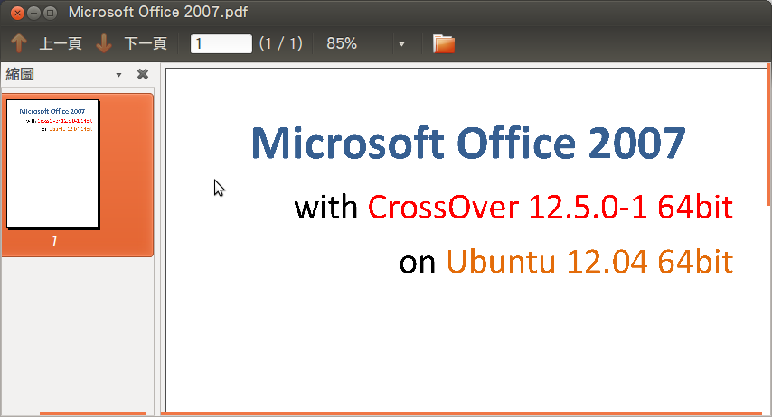

 ▲ 附上另存成 PDF 的文件截圖。

最後別忘了卸載 /mnt 或退出光碟唷。

	$ sudo umount /mnt

值得一提的是，另存 PDF 的套件凍仁只有在使用 CrossOver 安裝的 Office 2007 底下成功過，使用 Wine 的伙伴可能得放棄此功能。

### 資料來源

- [2007 Microsoft Office 增益集：Microsoft 另存 PDF 或 XPS 檔](http://www.microsoft.com/zh-tw/download/details.aspx?id=7)
- [Microsoft Office 2007 入門 - Office.com](http://office.microsoft.com/zh-hk/support/FX010105508.aspx)

