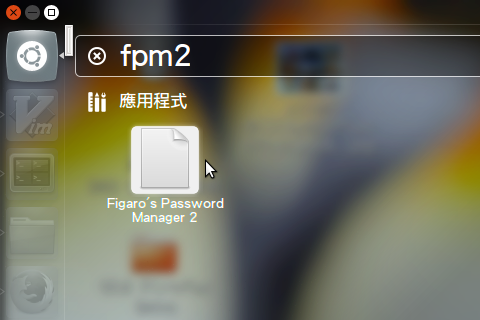
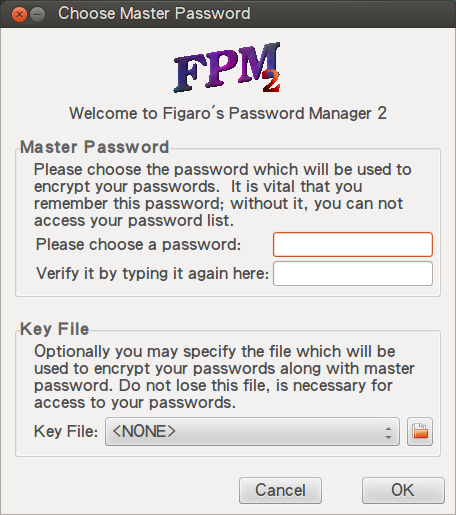
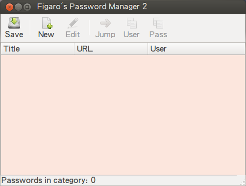
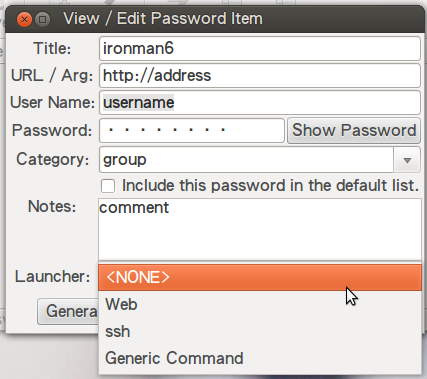
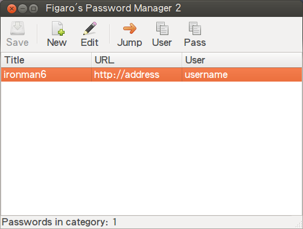
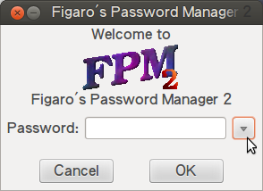
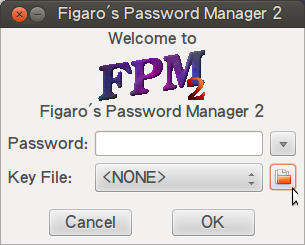
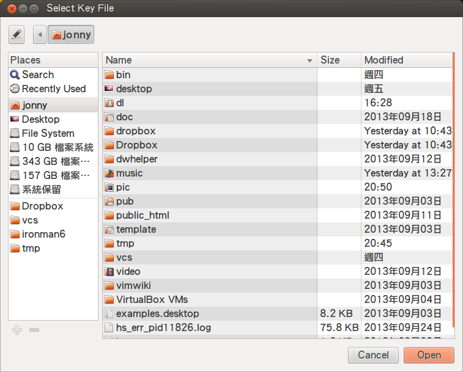
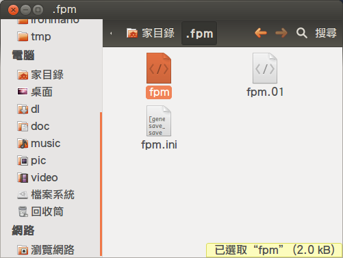

# 完全用 GNU/Linux 工作

## 22. 密碼管理員 - FPM2

[Figaro's Password Manager 2](http://als.regnet.cz/fpm2/) (fpm2) 是個基於 [Figaro's Password Manager](http://fpm.sourceforge.net/) 並使用 GTK+ 2.0 改寫的密碼管理員。它除了會將各個數值使用 AES-256 演算法 (algorithm) 加密以外，還可與特定檔案進行二次加密，兼具安全性與便利性，是凍仁工作上的好幫手。

安裝 fpm2。

	# Debian, Ubuntu
	$ sudo aptitude install fpm2 

▲ 搜索並執行 fpm2。

▲ 第一次執行需設定密碼 (或使用特定檔案進行二次加密)。

▲ 成功進入 fpm2。

▲ 新增帳密資訊。

▲ 完成後將於總表列出。

▲ 往後執行時需通過認證才可使用。

▲ 若一開始有使用特定檔案進行二次加密，除密碼外還得指定該檔案才行。

▲ 找到特定檔案後按下開啟 (Open)。

▲ FPM2 的密碼庫位於 $HOME/.fpm/fpm 。

或許會有伙伴懷疑 FPM2 安全性，這時可以使用文字編輯器開啟 $HOME/.fpm/fpm 即可知道答案。

### 資料來源

- [8 of the best Linux password managers | News | TechRadar](http://www.techradar.com/news/software/applications/8-of-the-best-linux-password-managers-916152)
