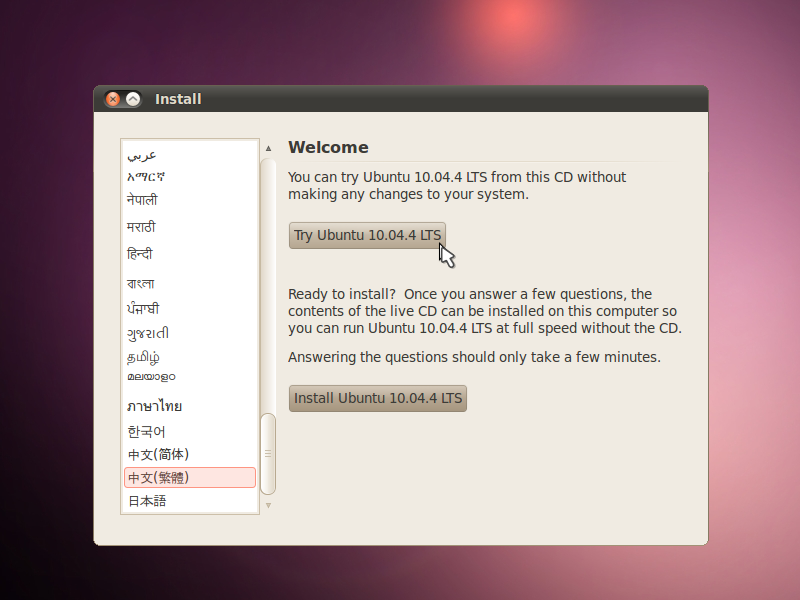
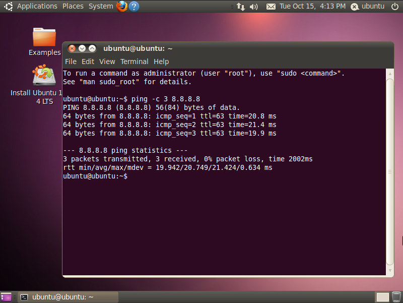

# 完全用 GNU/Linux 工作

## 28. 使用 Live CD 修復 Debian/Ubuntu 系統

承上文 [27. Ubuntu 系統版本升級](27.upgrading-ubuntu.md)，如今日不幸於系統升級時當機，最嚴重將導致系統無法開啟，這時可以透過 [Live CD](http://zh.wikipedia.org/wiki/Live_CD) 進行修復。

### 使用 Live CD 開機

1. 製作 Live CD 媒體，詳情請參考 [02. 建立開機媒體 (隨身碟、光碟)](02.build-bootable-usb-cd.md) 和 [26. 使用 Clonezilla 打造不死的作業系統](26.clonezilla.md) 章節。

2. 放入光碟或插入隨身碟。

3. 切換 BIOS 並使用 Live CD 媒體開機，詳情請參考[睡覺吹泡泡: 進入BIOS設定開機順序，以光碟開機為例](http://www.pptrar.tw/2011/01/bios.html)一文。

4. 進入 Live 模式。

 ▲ 請選擇嘗試 (Try) 以進入 Live 模式。

### 連接至網際網路 (Internet)

網路連接方式請參考 [03. 網路設定](03.network-setting.md) 一文。

▲ 可透過 ping 指令或 Firefox 測試網路連線。

### 修復系統

1. 掛載本機上欲修復 OS 的根目錄 (/)。

	   $ sudo mount /dev/sda1 /mnt/

2. 掛載開機選單目錄 (/boot)，如未獨立此分割區則略過。

	   $ sudo mount /dev/sda2 /mnt/boot

3. 掛載虛擬檔案系統 (/dev, /proc, /sys )。

	   $ sudo mount --bind /dev /mnt/dev
       $ sudo mount --bind /proc /mnt/proc
	   $ sudo mount --bind /sys /mnt/sys

4. 將本機的 OS 切換成系統根目錄。

	   $ sudo chroot /mnt

5. 如是升級時中斷，請手動完成更新。

	   $ sudo aptitude update ; sudo aptitude dist-upgrade

6. 如是套件安裝不完整，請手動修復套件。

	   $ sudo aptitude install -f

7. 如是設定不完整 (衝突) 時，請手動重設。

	   $ sudo dpkg-reconfigure -a

8. 如是開機選單 (grub) 陣亡，請使用 grub-install 指令手動修復。

	   $ grub-install --force /dev/sda

9. 修復後記得離開 chroot 模式並進行缷載的動作。

	   $ exit

10. 安全缷載先前掛載過的 partition。

        $ sudo umount /mnt/dev/ /mnt/proc/ /mnt/sys/ /mnt

恭喜您！現在您已具備修復 Debian/Ubuntu 的能力了，不過升級前還是先用 [Clonezilla](26.clonezilla.md) 備份一下會比較妥當。

### 資料來源

- [GRUB2中文指南第二版(上） - Ubuntu 正體中文 Wiki](http://wiki.ubuntu-tw.org/index.php?title=GRUB2%E4%B8%AD%E6%96%87%E6%8C%87%E5%8D%97%E7%AC%AC%E4%BA%8C%E7%89%88%28%E4%B8%8A%EF%BC%89)
