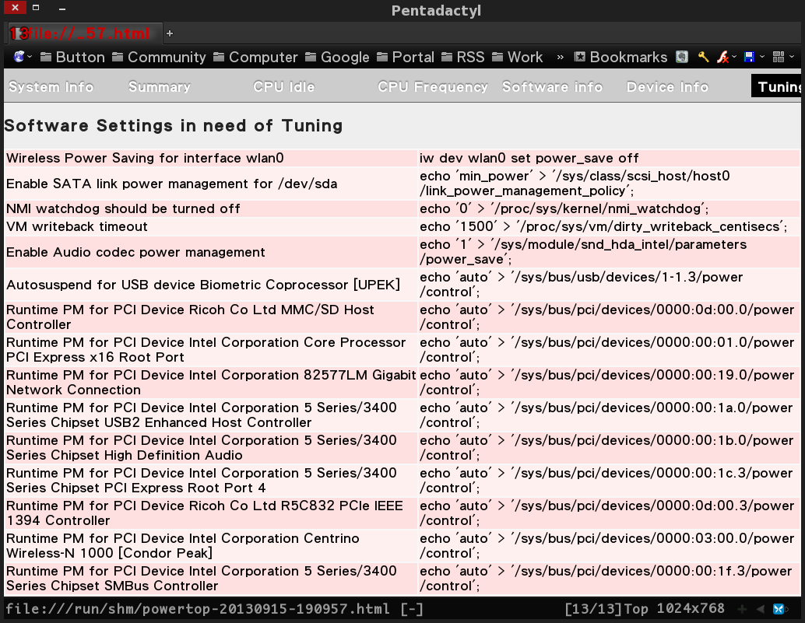

## PowerTOP

PowerTOP 是個 Linux 上的節電套件，透過關閉些不必要的裝置以達到省電的效果，但每每重開後都得重新啟用。仔細看過 Man page 就會知道它有個 '--html' 的參數可以列出詳細資訊。

	$ sudo powertop --html
	Loaded 58 prior measurements
	Cannot load from file /var/cache/powertop/saved_parameters.powertop
	Preparing to take measurements
	Measuring 1 time(s) for 20 seconds each
	PowerTOP outputing using base filename powertop-20130915-231821.html

而這份報告中會有屬於各個 Laptop 的節電指令，以下以 ThinkPad T410 為例。



將微調的指令使用一個 shell script 打包起來。

```
$ vi /usr/local/bin/powersave
#!/bin/bash
# PowerTop conifg for ThinkPad T410 on Debian Wheezy.

# Wireless Power Saving for interface wlan0
iw dev wlan0 set power_save off

# Enable SATA link power management for /dev/sda
echo 'min_power' > '/sys/class/scsi_host/host0/link_power_management_policy';

# NMI watchdog should be turned off
echo '0' > '/proc/sys/kernel/nmi_watchdog';

# VM writeback timeout
echo '1500' > '/proc/sys/vm/dirty_writeback_centisecs';

# Enable Audio codec power management	
echo '1' > '/sys/module/snd_hda_intel/parameters/power_save';

# Autosuspend for USB device Biometric Coprocessor [UPEK]	
echo 'auto' > '/sys/bus/usb/devices/1-1.3/power/control';

# Runtime PM for PCI Device Ricoh Co Ltd MMC/SD Host Controller
echo 'auto' > '/sys/bus/pci/devices/0000:0d:00.0/power/control';

# Runtime PM for PCI Device Intel Corporation Core Processor PCI Express x16 Root Port	
echo 'auto' > '/sys/bus/pci/devices/0000:00:01.0/power/control';

# Runtime PM for PCI Device Intel Corporation 82577LM Gigabit Network Connection	
echo 'auto' > '/sys/bus/pci/devices/0000:00:19.0/power/control';

# Runtime PM for PCI Device Intel Corporation 5 Series/3400 Series Chipset USB2 Enhanced Host Controller	
echo 'auto' > '/sys/bus/pci/devices/0000:00:1a.0/power/control';

# Runtime PM for PCI Device Intel Corporation 5 Series/3400 Series Chipset High Definition Audio	
echo 'auto' > '/sys/bus/pci/devices/0000:00:1b.0/power/control';

# Runtime PM for PCI Device Intel Corporation 5 Series/3400 Series Chipset PCI Express Root Port 4	
echo 'auto' > '/sys/bus/pci/devices/0000:00:1c.3/power/control';

# Runtime PM for PCI Device Ricoh Co Ltd R5C832 PCIe IEEE 1394 Controller	
echo 'auto' > '/sys/bus/pci/devices/0000:0d:00.3/power/control';

# Runtime PM for PCI Device Intel Corporation Centrino Wireless-N 1000 [Condor Peak]	
echo 'auto' > '/sys/bus/pci/devices/0000:03:00.0/power/control';

# Runtime PM for PCI Device Intel Corporation 5 Series/3400 Series Chipset SMBus Controller	
echo 'auto' > '/sys/bus/pci/devices/0000:00:1f.3/power/control';

# Runtime PM for PCI Device Intel Corporation 5 Series/3400 Series Chipset Thermal Subsystem	
echo 'auto' > '/sys/bus/pci/devices/0000:00:1f.6/power/control';

# Runtime PM for PCI Device Intel Corporation 5 Series/3400 Series Chipset 6 port SATA AHCI Controller	
echo 'auto' > '/sys/bus/pci/devices/0000:00:1f.2/power/control';

# Runtime PM for PCI Device NVIDIA Corporation GT218 [NVS 3100M]	
echo 'auto' > '/sys/bus/pci/devices/0000:01:00.0/power/control';

# Runtime PM for PCI Device Intel Corporation 5 Series/3400 Series Chipset USB2 Enhanced Host Controller	
echo 'auto' > '/sys/bus/pci/devices/0000:00:1d.0/power/control';

# Runtime PM for PCI Device Intel Corporation 5 Series/3400 Series Chipset PCI Express Root Port 1
echo 'auto' > '/sys/bus/pci/devices/0000:00:1c.0/power/control';

# Runtime PM for PCI Device Intel Corporation 5 Series/3400 Series Chipset PCI Express Root Port 5	
echo 'auto' > '/sys/bus/pci/devices/0000:00:1c.4/power/control';

# Runtime PM for PCI Device NVIDIA Corporation High Definition Audio Controller	
echo 'auto' > '/sys/bus/pci/devices/0000:01:00.1/power/control';

# Runtime PM for PCI Device Intel Corporation 5 Series/3400 Series Chipset PCI Express Root Port 2	
echo 'auto' > '/sys/bus/pci/devices/0000:00:1c.1/power/control';

# Wake-on-lan status for device eth0
#ethtool -s eth0 wol d;
```

給予執行權限。

	$ sudo chmod +x /usr/local/bin/powersave

現在凍仁開機時只需使用 `sudo powersave` 即可快速切換至**省電模式**。

